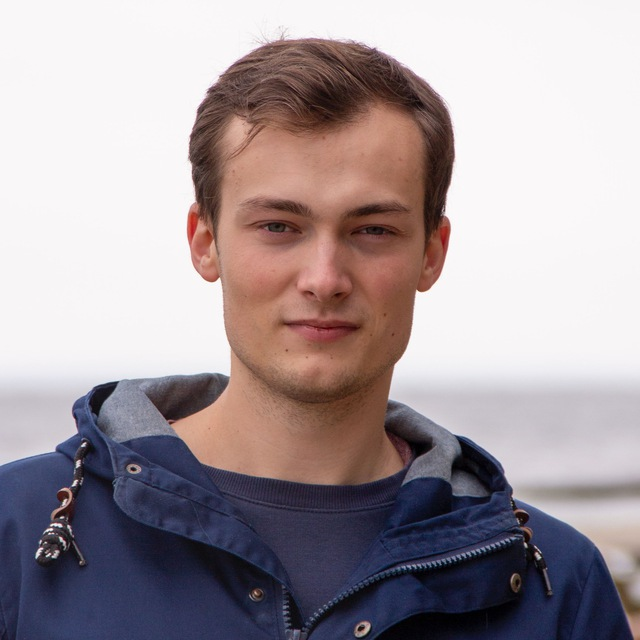

# Nick Shevchenko
Phone: +380 (99) 512 1648
Email: nickscreator@gmail.com
Discord: Nikita (@NickSCreator)
## Experience
### KEY ACCOUNT / SUPPORT, HUSHME, KYIV — 2020-2022
I have grown from customer support to key account over 2 years. My scope of responsibility included managing distributors and retail shops, as well as bloggers. My latest project is Hushme’s website www.gethushme.com. I’ve been designing marketing materials for Hushme speech privacy mask startup at ARTKB and joined their team in 2020.
### BUSINESS PARTNER, CUPL CUPS, KYIV — 2019-2020
My coffee shop specialized in specialty coffee with vegan options, as well as vegan desserts, and Chinese tea ceremony. It was located in downtown Kyiv. During the operation period of the small business I was working as an accountant, financial analyst as well as marketing specialist. I am very lucky to have such an experience, even though it stopped operating at the beginning of 2020.
### GRAPHIC DESIGNER, ARTKB, KYIV — 2017-2019
After acquiring skills needed for graphic design, I worked part-time at ARTKB www.artkb.net, an engineering company for 2 years. Over the course of that period I’ve been designing marketing materials in both print and digital formats.
## Skills
* Ability to multitask and manage a variety of projects in a dynamic environment (experience in
having part-time job while being a student from the first year of studies, simultaneous nature of
design projects development, entrepreneurial activity);
* High analytical skills;
Ability to prioritize and focus;
* JavaScript;
* HTML, CSS;
* Good knowledge of Adobe CC and Figma;
* Advanced project management workflow (Trello, Asana, Slack).
## Code Example
### Convert string to camel case
https://www.codewars.com/kata/517abf86da9663f1d2000003
`function toCamelCase(str) {
  
  function toCC(array) {
    var newArray = []
    newArray.push(array[0])
  
    for (let i = 1; i < array.length; i++) {
      newArray.push(array[i][0].toUpperCase() + array[i].slice(1, array[i].length))
    }
  
    var newString = newArray.join('')
    return newString
  }
  
  if (str === '') {
    result = ''
  }
  else if (str.includes('-')) {
    var array = str.split('-')
    result = toCC(array)
  }
  else if (str.includes('_')) {
    var array = str.split('_')
    result = toCC(array)
  }
  return result
}`
## Education
* Economics, University of "Kyiv-Mohyla Academy”, Kyiv, Ukraine — Bachelor’s Degree – 2017-2021, taught in Ukrainian and English
* Design, School of Form, Poznan, Poland — Bachelor’s Degree – 2016-2017, taught in English
* Graphic Design, “Shag” Academy, Kyiv, Ukraine — 2014-2015, taught in Ukrainian
## English proficiency
C1 (advanced)